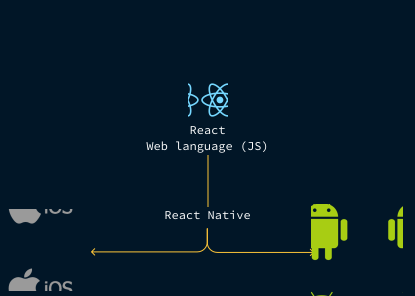
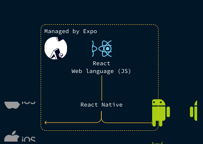
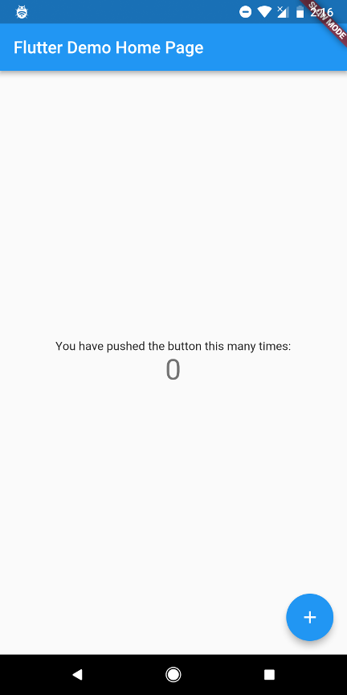

import './scripts.js';
export { default as theme } from './theme';
import { Appear } from 'mdx-deck';
import { Head, Image } from 'mdx-deck';
import { Split } from 'mdx-deck/layouts';
import nightOwl from 'prism-react-renderer/themes/nightOwl';
import { CodeSurfer } from 'mdx-deck-code-surfer';
import { Code } from './components/code';
import { CodeSurferNoZoom } from './components/code-surfer-no-zoom';
import { ReadMore } from './components/read-more';

<Head>
	<title>Introducing React Native</title>
</Head>

## Prerequisities

<ol style={{ fontSize: '1em' }}>
	<li>
		Install Node.js version 10 or higher from{' '}
		<a href="https://nodejs.org">nodejs.org</a> (LTS or Current, doesn't matter)
	</li>
	<li>Install Expo CLI by running `npm install -g expo-cli` in the terminal</li>
	<li>
		Make sure everything is as it should be, by running the following in the
		terminal:
	</li>
	<ul>
		<li>
			<code>node -v</code> (at least v10)
		</li>
		<li>
			<code>npm -v</code> (at least v5)
		</li>
		<li>
			<code>expo -V</code> (should be v2.13.0 or higher)
		</li>
	</ul>
	<li>Have a smartphone, at least iOS v10 or Android v5</li>
	<li>Android: Install the "Expo" app from Google Play Store</li>
	<li>iOS: Install the "Expo Client" from Apple App Store</li>
</ol>

---

# Introducing React Native

### Getting better at React

by Jeppe Reinhold - [@JReinhold](https://twitter.com/drreinhold)

---

# Introduction to me and React (Native)

## Part 1

---

<ul style={{ fontSize: '1.5em' }}>
	<li>I'm Jeppe 🙋‍♀️</li>
	<Appear>
		<li>
			I’ve done web development and specifically React development for over two
			years
		</li>
		<li>
			I now build cool apps at <a href="https://reccoon.dk">Reccoon</a> - come
			say hi in HatchIT Lab!
		</li>
		<li>The workshop is split into a few parts</li>
		<li>We'll get as far as the time allows us - we'll see what happens</li>
		<li>Who are you?</li>
	</Appear>
</ul>

---

# Agenda

<ol style={{ fontSize: '1.3em' }}>
	<Appear>
		<li>Introduction to me, React (Native) and getting started</li>
		<li>Making simple changes</li>
		<li>Dynamic components with props</li>
		<li style={{ opacity: 0.5 }}>Stateful components with... state 🤷‍♀️</li>
		<li>Wrapping up and alternatives to React Native</li>
	</Appear>
</ol>

---

# Demonstration

## What we can build

---

# What is React Native?

---

<div className="stacked-container" style={{ width: '80vw', height: '80vh' }}>
	<Appear>
		
		
	</Appear>
</div>

---

# What does it look like?

---

<CodeSurferNoZoom
	code={require('!raw-loader!./examples/simple.js')}
	lang="jsx"
	showNumbers={true}
	theme={nightOwl}
	steps={[{}]}
/>

---

<CodeSurferNoZoom
	code={require('!raw-loader!./examples/App.js')}
	lang="jsx"
	showNumbers={true}
	theme={nightOwl}
	steps={[
		{},
		{ range: [1, 3] },
		{ range: [12, 19] },
		{ range: [5, 20] },
		{
			range: [22, 27],
		},
		{},
	]}
/>

---


---

1. Initialize Expo project - `expo init MyCoolProject`
2. Select "minimal"
3. Wait..
4. `cd MyCoolProject`
5. Start development server - `expo start`
6. (Maybe press tunnel)
7. Scan QR-code with smartphone

---

# Part 2

## Making simple changes

- Structure
- Behaviour
- Styling

---

### Cheatsheet

1. Common built-in components: `View, Text, Button, ScrollView, Image`
2. To reference JavaScript code outside of JSX, use curly braces: `{variable}`
3. Use `this.` to reference variables inside a class
4. Define class functions using

```
greet = () => {
	// do stuff here
}
```

---

# Part 3

## Components and props

---

### The component model


---

<CodeSurferNoZoom
	title="Component nesting"
	code={require('!raw-loader!./examples/Component.js')}
	lang="jsx"
	showNumbers={true}
	theme={nightOwl}
	steps={[{}, { lines: [8], range: [15, 19] }]}
/>

---

<CodeSurferNoZoom
	title="Customizing components with props"
	code={require('!raw-loader!./examples/props.js')}
	lang="jsx"
	showNumbers={true}
	theme={nightOwl}
	steps={[{}, { lines: [9, 10], range: [16, 20] }]}
/>

---

### Cheatsheet

1. Add props:

```
<Component propName={variable} other={2} />
```

2. Read prop:

```
this.props.propName
```

(remember curly-braces in JSX)

---

# Part 4

## State!

---

### Over to you - Jeppe!


[Introduction to React slides - #27](https://docs.google.com/presentation/d/1IddQDSYwFbXjlfJKuhlogpHmtkqie8K4cgf3FjtmKOk/edit#slide=id.g442c3a9a06_0_33)

---

# Part 5

## Wrapping up

---

# "Wow, this was great!"

## Option 1

---

## Next steps

1. Get comfortable in React - [Official docs and tutorials on reactjs.org are great](https://reactjs.org/tutorial/tutorial.html)
2. React Native has [great docs as well](https://facebook.github.io/react-native/)
3. Wanna build screens? Take a look at [reactnavigation.org](https://reactnavigation.org/)

- Deltag i vores ['Introduktion to React'-worksop](https://www.prosa.dk/nc/arrangementer/arrangement/introduktion-til-react/) hos PROSA i Aalborg - 23. april

---

# "Holy moly, this was ass!"

## Option 2

---

# Alternatives

- [Flutter](https://flutter.dev/)
- [Ionic](https://ionicframework.com/)

---

### Flutter

- Flutter is written in Dart - a lovechild between JavaScript and Java
- Theoretical more performant than React Native because it compiles directly to native code
- Very similar architecture pattern (`components`, `props`, `state`)
- Immature, small community, but great docs
- Pretty different syntax

---

### React Native vs Flutter



---

<div className="split-code-surfer">
	<CodeSurferNoZoom
		code={require('!raw-loader!./examples/flutter-compare-flutter.js')}
		lang="jsx"
		theme={nightOwl}
		showNumbers={true}
		steps={[
			{},
			{ lines: [1] },
			{ lines: [3, 4, 27, 28] },
			{ range: [5, 11] },
			{ range: [12, 20] },
			{ range: [23, 27] },
			{}
		]}
	/>
	<CodeSurferNoZoom
		code={require('!raw-loader!./examples/flutter-compare-rn.js')}
		lang="jsx"
		theme={nightOwl}
		showNumbers={true}
		steps={[
			{},
			{ lines: [1] },
			{ lines: [2,3,18,19] },
			{ lines: [4,5,16,17], range: [22,27] },
			{ range: [6, 9], lines: [28,29,30] },
			{ range: [10, 15] },
			{}
		]}
	/>
</div>

---

### Ionic

- Basically just a browser in an app
- HTML, CSS, JS (Angular)
- Not nearly as performant as Flutter or React Native
- Easy to get going

---

<div
	style={{
		display: 'flex',
		flexDirection: 'column',
		fontSize: '2em',
	}}
>
	🙋‍♂️
	<a href="https://twitter.com/drreinhold" target="_blank" className="link">
		@DrReinhold
	</a>
	<a href="mailto:jeppereinhold@gmail.com" target="_blank" className="link">
		jeppereinhold@gmail.com
	</a>
	<h3>See you at AUHack!</h3>
</div>

---


